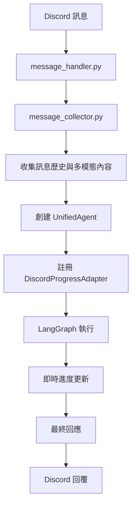
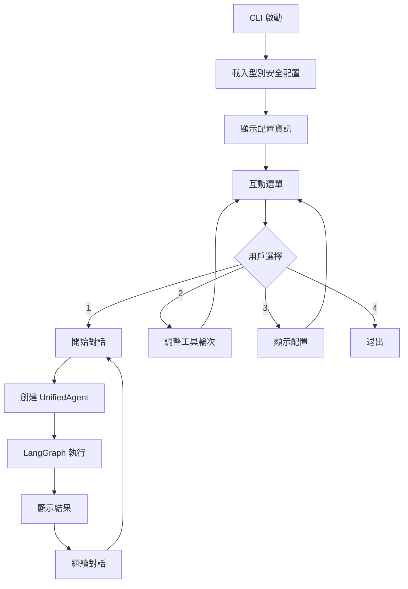

# DCPersona 專案架構與實現說明

---

## 專案檔案結構

```
DCPersona/
│
├── main.py                  # Discord Bot 主程式入口，初始化與啟動
├── cli_main.py              # CLI 測試介面，支援對話模式和配置調整
├── config.yaml              # 系統設定檔（型別安全配置）
├── personas/                # Agent 人格系統提示詞資料夾
│
├── discord_bot/             # **[核心]** Discord 整合層
│   ├── client.py            # Discord Client 初始化與設定
│   ├── message_handler.py   # Discord 訊息事件處理主流程
│   ├── message_collector.py # 訊息收集、歷史處理與多模態支援
│   ├── progress_manager.py  # Discord 進度消息管理系統
│   └── progress_adapter.py  # Discord 進度適配器（支援串流回應）
│
├── agent_core/              # **[核心]** 統一 Agent 處理引擎
│   ├── graph.py             # LangGraph 構建與 Agent 節點實現
│   ├── agent_session.py     # Agent 會話狀態管理與生命週期
│   ├── agent_utils.py       # Agent 核心輔助函式
│   ├── progress_observer.py # 進度觀察者介面（支援串流）
│   └── progress_mixin.py    # 進度更新混入（整合串流功能）
│
├── schemas/                 # **[重要]** 型別安全資料架構
│   ├── agent_types.py       # Agent 相關型別定義（狀態、計劃等）
│   ├── config_types.py      # 完整的型別安全配置定義
│   └── __init__.py
│
├── prompt_system/           # 統一提示詞管理系統
│   ├── prompts.py           # 核心提示詞功能與 PromptSystem
│   └── tool_prompts/        # 工具相關提示詞模板
│
├── utils/                   # 通用工具與配置
│   ├── config_loader.py     # 型別安全配置載入器
│   ├── logger.py            # 日誌系統設定
│   ├── common_utils.py      # 通用輔助函式
│   └── __init__.py
│
└── tests/                   # 測試檔案
    └── ...                  # 各種單元測試與整合測試
```

---

## 核心架構設計理念

### 1. 統一 Agent 架構
本專案採用基於 LangGraph 的統一 Agent 架構，實現了：

- **配置驅動的代理行為**: 透過 `config.yaml` 動態調整 Agent 能力
- **智能工具決策**: Agent 根據問題複雜度自主決定使用哪些工具
- **多輪對話支援**: 支援複雜的多步驟研究與推理流程
- **進度即時回饋**: 整合串流回應，提供即時進度更新

### 2. 型別安全配置系統
完全採用 dataclass 配置架構，消除字串 key 存取：

- **嚴格型別檢查**: 所有配置欄位都有明確的型別定義
- **配置驗證**: 啟動時自動驗證配置完整性
- **IntelliSense 支援**: IDE 可提供完整的自動完成

### 3. 模組化與解耦設計
各模組職責清晰，低耦合高內聚：

- **Discord 層獨立**: 可輕鬆替換為其他平台
- **Agent 核心通用**: 支援 CLI 和 Discord 雙模式
- **工具系統可擴展**: 標準化的工具介面

---

## 主要工作流程

### Discord Bot 工作流程



**詳細步驟說明**:
1. **訊息接收**: `message_handler.py` 接收 Discord 事件
2. **權限檢查**: 驗證使用者權限和頻道設定
3. **訊息收集**: `message_collector.py` 收集對話歷史和圖片等多模態內容
4. **Agent 初始化**: 創建 `UnifiedAgent` 實例並配置進度觀察者
5. **LangGraph 執行**: 執行 `generate_query_or_plan` → `execute_tools` → `reflection` → `finalize_answer` 流程
6. **進度回饋**: 透過 `DiscordProgressAdapter` 即時更新 Discord 訊息
7. **結果回覆**: 將最終答案格式化後回覆到 Discord

### CLI 工作流程



**主要功能**:
- **配置管理**: 動態調整工具輪次、檢視當前配置
- **對話模式**: 支援連續對話，保持上下文
- **除錯功能**: 顯示工具使用情況和執行統計

---

## 核心模組詳解

### agent_core/ - 統一 Agent 引擎

#### `graph.py` - LangGraph 核心實現
這是整個系統的核心，實現了基於 LangGraph 的智能代理：

**主要組件**:
- `UnifiedAgent`: 統一代理類，整合所有功能
- `generate_query_or_plan`: 智能計劃生成節點
- `execute_single_tool`: 並行工具執行節點
- `reflection`: 結果評估與反思節點
- `finalize_answer`: 最終答案生成節點

**關鍵特性**:
- **動態工具決策**: 根據問題複雜度自動選擇工具
- **並行執行**: 支援同時執行多個搜尋查詢
- **智能反思**: 評估結果充分性，決定是否需要更多資訊
- **進度整合**: 內建進度通知機制

#### `progress_mixin.py` & `progress_observer.py` - 進度系統
實現了觀察者模式的進度通知系統：

- **解耦設計**: Agent 專注核心邏輯，進度處理獨立
- **多觀察者支援**: 可同時通知多個進度處理器
- **串流支援**: 整合即時串流回應功能

### discord_bot/ - Discord 整合層

#### `message_handler.py` - 核心訊息處理器
負責 Discord 與 Agent 系統的橋接：

**主要功能**:
- 權限檢查與頻道過濾
- 訊息歷史收集協調
- Agent 實例管理
- 進度適配器註冊

#### `message_collector.py` - 多模態訊息收集
處理複雜的訊息收集邏輯：

**支援功能**:
- **對話歷史**: 智能提取相關對話上下文
- **多模態內容**: 支援文字、圖片等多種輸入格式
- **內容過濾**: 根據配置限制訊息長度和數量
- **結構化輸出**: 轉換為標準 `MsgNode` 格式

#### `progress_adapter.py` - Discord 進度整合
實現 Discord 特定的進度顯示：

**功能特性**:
- **即時更新**: 根據配置間隔更新 Discord 訊息
- **串流支援**: 支援逐字串流回應
- **狀態指示**: 使用表情符號指示不同處理階段
- **錯誤處理**: 優雅處理網路異常和API限制

### schemas/ - 型別安全架構

#### `config_types.py` - 完整配置定義
定義了所有配置的型別安全結構：

**主要配置類**:
- `AppConfig`: 根配置類
- `AgentConfig`: Agent 行為配置
- `DiscordConfig`: Discord 相關設定
- `ToolConfig`: 工具配置與優先級
- `LLMConfig`: 多 LLM 實例配置

#### `agent_types.py` - Agent 核心型別
定義 Agent 系統的核心資料結構：

**重要型別**:
- `OverallState`: LangGraph 全域狀態
- `MsgNode`: 標準化訊息節點（支援多模態）
- `AgentPlan`: Agent 執行計劃
- `ToolPlan`: 個別工具執行計劃

---

## 多模態支援實現

### 圖片處理流程
本系統支援 Discord 圖片輸入的完整處理：

1. **圖片接收**: `message_collector.py` 收集 Discord 附件
2. **Base64 編碼**: 將圖片轉換為 LLM 可處理的格式
3. **結構化儲存**: 使用 `MsgNode.content` 的 `List[Dict]` 格式
4. **LLM 傳遞**: 直接傳遞給支援多模態的 LLM 模型

### 配置範例
```yaml
discord:
  limits:
    max_images: 5           # 最大圖片數量
    max_text: 8000         # 最大文字長度
    max_messages: 20       # 最大訊息歷史
  enable_conversation_history: true
```

---

## 工具系統架構

### 工具系統架構
工具功能已整合到 `agent_core/graph.py` 中，包括：

- **Google Search**: 整合 Google Generative AI 搜尋功能
- **內建工具邏輯**: 直接嵌入到 LangGraph 節點中

### 工具擴展機制
未來可透過擴展 Agent 節點來添加新工具功能。

---

## 配置系統特色

### 型別安全存取
```python
# 舊方式（已淘汰）
max_rounds = config.get("agent", {}).get("behavior", {}).get("max_tool_rounds", 3)

# 新方式（型別安全）
max_rounds = config.agent.behavior.max_tool_rounds
```

### 動態配置驗證
啟動時自動檢查：
- 必要欄位完整性
- 型別正確性
- 邏輯一致性（如工具啟用但缺少 API 金鑰）

---

## 測試與品質保證

### 測試覆蓋範圍
- **單元測試**: 各模組核心功能測試
- **整合測試**: Agent 流程端到端測試
- **配置測試**: 型別安全配置載入測試

### 執行測試
```bash
# 執行所有測試
python -m pytest tests/ -v

# CLI 功能測試
python cli_main.py

# Discord Bot 手動測試（需要配置）
python main.py
```

---

## 部署與維護

### 環境設定
1. **安裝依賴**: `pip install -r requirements.txt`
2. **配置文件**: 複製 `config-example.yaml` 為 `config.yaml`
3. **環境變數**: 設定 `GEMINI_API_KEY` 和 Discord Token
4. **權限配置**: 配置 Discord 頻道與使用者權限

### 監控與日誌
- **結構化日誌**: 使用標準 logging 模組
- **進度追蹤**: 內建進度觀察者系統
- **錯誤處理**: 多層次錯誤處理與降級機制

---

## 未來發展方向

### Phase 2 規劃功能
1. **Persona 系統整合**: 完整的人格化對話體驗
2. **擴展工具生態**: 更多專業工具整合
3. **性能優化**: 並行處理與快取機制
4. **多平台支援**: Telegram、Line 等平台整合

### 架構演進目標
- **微服務化**: 核心功能服務化部署
- **分散式處理**: 支援高並發使用場景
- **智能路由**: 根據問題類型智能分配處理資源

---

## 總結

DCPersona 採用現代化的型別安全架構和統一 Agent 設計，實現了高度可配置、可擴展的智能對話系統。透過 LangGraph 的強大流程控制能力，結合多模態輸入支援和即時進度回饋，為使用者提供了流暢且智能的互動體驗。

系統的模組化設計確保了優秀的可維護性，而型別安全的配置系統則大幅提升了開發效率和系統穩定性。未來將持續朝向更智能、更個性化的 AI 助手方向發展。✨
