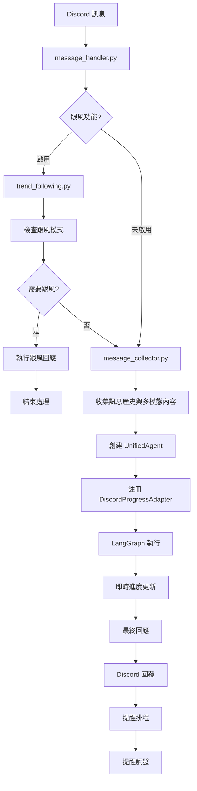
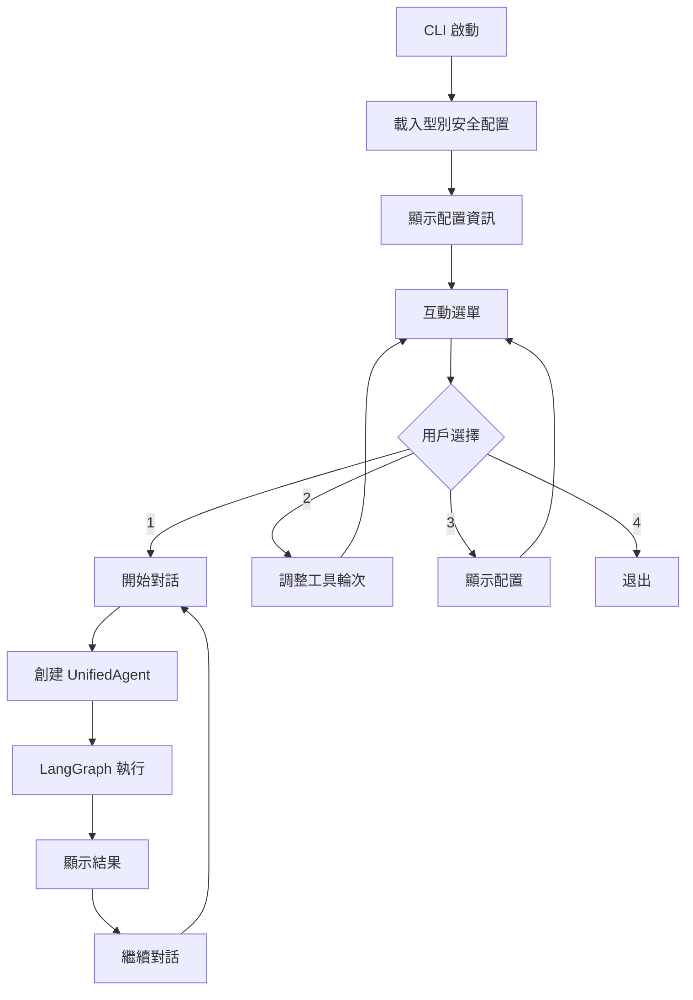
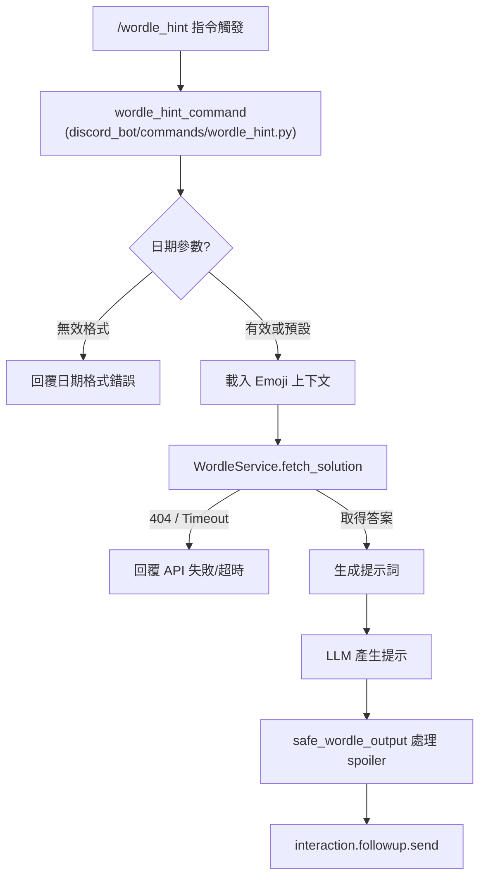

# DCPersona 專案架構與實現說明

---

## 專案檔案結構

```
DCPersona/
│
├── main.py                  # Discord Bot 主程式入口，初始化與啟動
├── cli_main.py              # CLI 測試介面，支援對話模式和配置調整
├── config-example.yaml      # 系統設定檔（型別安全配置）
├── emoji_config.yaml        # **[新增]** Emoji 系統配置檔（伺服器和應用程式 emoji）
├── personas/                # Agent 人格系統提示詞資料夾
│
├── tools/                   # **[新增]** LangChain 工具定義
│   ├── google_search.py     # Google 搜尋工具
│   ├── youtube_summary.py   # YouTube 摘要工具
│   └── set_reminder.py      # 設定提醒工具
│
├── event_scheduler/         # **[新增]** 通用事件排程系統
│   └── scheduler.py         # 基於 APScheduler 的排程器核心
│
├── discord_bot/             # **[核心]** Discord 整合層
│   ├── client.py            # Discord Client 初始化與設定
│   ├── commands/            # Slash Command 定義 (自動掃描並集中註冊)
│   ├── message_handler.py   # Discord 訊息事件處理主流程
│   ├── message_collector.py # 訊息收集、歷史處理與多模態支援 (Input)
│   ├── progress_manager.py  # Discord 進度消息管理系統
│   ├── progress_adapter.py  # Discord 進度適配器（支援串流回應）
│   ├── message_manager.py   # Discord 訊息快取管理
│   └── trend_following.py   # **[新增]** 跟風功能處理器
│
├── output_media/            # ✨ 輸出媒體管線 (Output)
│   ├── emoji_registry.py    # Emoji 註冊與格式化
│   ├── sticker_registry.py  # Sticker 註冊 (預留)
│   ├── context_builder.py   # 媒體提示上下文建構 + Emoji 格式防呆補償
│   └── emoji_types.py       # Emoji 系統型別定義
│
├── agent_core/              # **[核心]** 統一 Agent 處理引擎
│   ├── graph.py             # LangGraph 構建與 Agent 節點實現
│   ├── agent_utils.py       # Agent 核心輔助函式
│   ├── progress_observer.py # 進度觀察者介面（支援串流）
│   ├── progress_types.py    # ProgressStage / ToolStatus 枚舉與符號映射，提供型別安全的進度階段
│   └── progress_mixin.py    # 進度更新混入（整合串流功能）
│
├── schemas/                 # **[重要]** 型別安全資料架構
│   ├── agent_types.py       # Agent 相關型別定義（狀態、計劃等）
│   ├── config_types.py      # 完整的型別安全配置定義
│   ├── progress_types.py    # ProgressStage / ToolStatus 枚舉與符號映射，提供型別安全的進度階段
│   ├── input_media_config.py # ✨ 輸入媒體配置型別
│   └── __init__.py
│
├── prompt_system/           # 統一提示詞管理系統
│   ├── prompts.py           # 核心提示詞功能與 PromptSystem
│   ├── emoji_handler.py     # **[新增]** Emoji 處理器（智能建議與格式化）
│   └── tool_prompts/        # 工具相關提示詞模板
│
├── utils/                   # 通用工具與配置
│   ├── config_loader.py     # 型別安全配置載入器
│   ├── logger.py            # 日誌系統設定
│   ├── common_utils.py      # 通用輔助函式
│   ├── image_processor.py   # 圖片 / Emoji / Sticker / 動畫處理核心
│   ├── input_emoji_cache.py # ✨ 輸入 Emoji 快取
│   ├── wordle_service.py    # Wordle 遊戲提示服務
│   ├── youtube_utils.py     # YouTube URL 解析與工具輔助
│   └── __init__.py
│
└── tests/                   # 測試檔案
    ├── test_emoji_system.py # **[新增]** Emoji 系統完整測試（21 項測試）
    └── ...                  # 各種單元測試與整合測試
```

---

## 核心架構設計理念

### 1. 統一 Agent 架構
本專案採用基於 LangGraph 的統一 Agent 架構，實現了：

- **配置驅動的代理行為**: 透過 `config-example.yaml` 動態調整 Agent 能力
- **智能工具決策**: Agent 根據問題複雜度自主決定使用哪些工具
- **多輪對話支援**: 支援複雜的多步驟研究與推理流程
- **智能串流系統**: 整合即時串流回應，支援基於時間和內容長度的智能更新策略
- **統一進度管理**: 觀察者模式的解耦進度系統，支援多平台適配

### 2. 型別安全配置系統
完全採用 dataclass 配置架構，消除字串 key 存取：

- **嚴格型別檢查**: 所有配置欄位都有明確的型別定義
- **配置驗證**: 啟動時自動驗證配置完整性
- **IntelliSense 支援**: IDE 可提供完整的自動完成
- **串流配置**: 支援串流啟用控制和內容長度閾值設定
- **進度配置**: 靈活的進度更新間隔和顯示模式配置

### 3. 模組化與解耦設計
各模組職責清晰，低耦合高內聚：

- **Discord 層獨立**: 可輕鬆替換為其他平台
- **Agent 核心通用**: 支援 CLI 和 Discord 雙模式
- **工具系統可擴展**: 標準化的工具介面
- **統一訊息管理**: 所有 Discord 訊息操作統一通過 ProgressManager 處理
- **進度系統解耦**: 觀察者模式支援自定義進度處理器

---

## 主要工作流程

### Discord Bot 工作流程



**詳細步驟說明**:
1. **訊息接收**: `message_handler.py` 接收 Discord 事件
2. **跟風處理**: 優先檢查並處理跟風功能（如果啟用）
3. **權限檢查**: 驗證使用者權限和頻道設定
4. **訊息收集**: `message_collector.py` 收集對話歷史和圖片等多模態內容
5. **Agent 初始化**: 創建 `UnifiedAgent` 實例並配置進度觀察者
6. **LangGraph 執行**: 執行 `generate_query_or_plan` → `execute_tools` → `reflection` → `finalize_answer` 流程
7. **智能串流處理**: 在 `finalize_answer` 階段根據配置啟用串流回應，基於時間和內容長度智能更新
8. **統一進度管理**: 透過 `DiscordProgressAdapter` 和 `ProgressManager` 統一處理所有 Discord 訊息操作
9. **Emoji 格式防呆補償**: `DiscordProgressAdapter` 在所有 final_answer 輸出階段，透過 `OutputMediaContextBuilder.parse_emoji_output()` 自動修復 LLM 輸出的常見 emoji 格式錯誤
10. **結果回覆**: 將最終答案格式化後回覆到 Discord，支援串流和非串流兩種模式
11. **提醒排程**:
    - 若 Agent 執行 `set_reminder` 工具成功，`message_handler.py` 會從 Agent 狀態中提取 `ReminderDetails`。
    - 將 `ReminderDetails` 傳遞給 `EventScheduler` 進行排程。
12. **提醒觸發**:
    - `EventScheduler` 觸發事件時，會呼叫 `message_handler.py` 中註冊的回調。
    - 回調函數會建構一個模擬的 `MsgNode`，並重新送回 Agent 處理，以生成提醒訊息。

### CLI 工作流程



### Slash Command 工作流程 (`/wordle_hint`)

除了透過對話與 Agent 互動外，DCPersona 也支援特定的 Slash Commands，提供更直接的功能操作。



**詳細步驟說明**:
1.  **指令觸發**: 使用者在 Discord 中執行 `/wordle_hint` 命令，可選擇性提供 `date` 參數。
2.  **指令處理**: `discord_bot/commands/wordle_hint.py` 中定義的 `wordle_hint_command` 透過 `register_commands(bot)` 事先註冊到 `DCPersonaBot`，收到互動後開始處理指令。
3.  **日期解析**: 若使用者未提供日期，則使用系統預設時區的當前日期。
4.  **獲取答案**: 呼叫 `utils/wordle_service.py` 中的 `WordleService` 從 NYT API 獲取指定日期的 Wordle 答案。若 API 請求失敗則向使用者回覆錯誤訊息。
5.  **提示詞生成**: 使用 `PromptSystem` 載入 `wordle_hint_instructions.txt` 模板，並從 `prompt_system/tool_prompts/wordle_hint_types/` 隨機注入一種提示風格，再填入答案和 Persona 風格。
6.  **LLM 呼叫**: 呼叫 LLM 模型生成創意提示。
7.  **Emoji 格式修復**: 使用 `OutputMediaContextBuilder.parse_emoji_output()` 修復 LLM 輸出中的 emoji 格式錯誤。
8.  **安全後處理**: 使用 `safe_wordle_output` 函數確保 LLM 的回覆包含 Discord Spoiler Tag (`||...||`)。
9.  **回覆使用者**: 將最終提示回覆到 Discord 頻道（由 `wordle_hint_command` 直接調用 `interaction.followup.send()`）。

---

## 核心模組詳解

### agent_core/ - 統一 Agent 引擎

#### `graph.py` - LangGraph 核心實現
這是整個系統的核心，實現了基於 LangGraph 的智能代理：

**主要組件**:
- `UnifiedAgent`: 統一代理類，整合所有功能
- `generate_query_or_plan`: 智能計劃生成節點，LLM 在此決定是否呼叫工具。
- `execute_tools_node`: 負責解析 LLM 的 `tool_calls` 並執行對應的 LangChain 工具。
- `reflection`: 結果評估與反思節點
- `finalize_answer`: 最終答案生成節點

**關鍵特性**:
- **動態工具決策**: LangChain 模型根據對話上下文和工具描述，自動決定何時以及如何使用工具。
- **LangChain 工具整合**: 透過 `llm.bind_tools()` 將 `tools/` 目錄下的工具綁定到模型，實現自動化的提示詞注入和參數解析。
- **並行執行**: 支援同時執行多個搜尋查詢
- **智能反思**: 評估結果充分性，決定是否需要更多資訊
- **進度整合**: 內建進度通知機制

#### `progress_mixin.py` & `progress_observer.py` - 進度系統
實現了觀察者模式的進度通知系統：

- **解耦設計**: Agent 專注核心邏輯，進度處理獨立
- **多觀察者支援**: 可同時通知多個進度處理器
- **完整串流支援**: 整合 `on_streaming_chunk` 和 `on_streaming_complete` 方法
- **統一介面**: 提供標準化的進度觀察者介面，支援自定義實現
- **並行通知**: 支援並行通知所有註冊的觀察者，提高響應效率
- **LLM 智能進度訊息**: 支援透過 LLM 自動生成個性化進度訊息，可透過配置啟用/關閉
- **型別安全進度**: 使用 ProgressStage 枚舉確保進度階段的型別安全與一致性

### discord_bot/ - Discord 整合層

#### `message_handler.py` - 核心訊息處理器
負責 Discord 與 Agent 系統的橋接：

**主要功能**:
- 權限檢查與頻道過濾
- 訊息歷史收集協調
- Agent 實例管理
- 進度適配器註冊
- **事件排程與觸發**: 負責將 Agent 產生的提醒請求排程到 `EventScheduler`，並處理排程器觸發後的回調邏輯。

#### `message_collector.py` - 多模態訊息收集
處理複雜的訊息收集邏輯：

**支援功能**:
- **對話歷史**: 智能提取相關對話上下文
- **多模態內容**: 支援文字、圖片等多種輸入格式，圖片會被轉換為 Base64 編碼
- **訊息去重複與排序**: 根據訊息 ID 進行去重複，並依時間戳進行排序，確保上下文的準確性和時間順序
- **內容過濾**: 根據配置限制訊息長度和數量
- **結構化輸出**: 轉換為標準 `MsgNode` 格式

**重要型別**:
- `OverallState`: LangGraph 全域狀態
- `MsgNode`: 標準化訊息節點（支援多模態）
- `AgentPlan`: Agent 執行計劃
- `ReminderDetails`: 儲存提醒事件的詳細資訊（內容、時間、頻道 ID 等）。
- `ToolExecutionResult`: 標準化工具執行結果的資料結構，包含成功狀態和訊息。

#### `progress_adapter.py` - Discord 進度整合
實現 Discord 特定的進度顯示：

**功能特性**:
- **統一訊息管理**: 所有 Discord 訊息操作統一通過 ProgressManager 處理
- **智能串流支援**: 基於時間和內容長度的智能串流更新策略
- **即時進度更新**: 根據配置間隔更新 Discord 訊息
- **多階段支援**: 支援 starting、searching、analyzing、streaming、completed 等多種階段
- **狀態指示**: 使用表情符號和 embed 格式指示不同處理階段
- **錯誤處理**: 優雅處理網路異常和API限制，自動回退機制
- **Emoji 格式防呆補償**: 透過 `OutputMediaContextBuilder.parse_emoji_output()` 自動修復 LLM 輸出的常見 emoji 格式錯誤

#### `message_manager.py` - Discord 訊息快取管理
管理 Discord 訊息的快取和緩存：

**主要功能**:
- **訊息快取**: 儲存最近接收的訊息
- **緩存管理**: 管理訊息的過期和清理
- **性能優化**: 減少重複訊息處理

#### `trend_following.py` - 跟風功能處理器
實現 Discord 頻道中的智能跟風功能：

**核心功能**:
- **Reaction 跟風**: 當訊息 reaction 達到設定閾值時，Bot 自動添加相同 reaction
- **內容跟風**: 檢測連續相同訊息內容（文字或 sticker）並自動複製發送
- **Emoji 跟風**: 識別連續純 emoji 訊息，使用 LLM 生成適合的 emoji 回應

**關鍵特性**:
- **頻道鎖機制**: 使用 asyncio.Lock 防止同一頻道的併發處理導致重複回應
- **Bot 循環防護**: 智能檢測 Bot 是否已參與相同模式的跟風，避免無限循環
- **配置驅動**: 支援頻道級啟用控制、可調整的閾值和冷卻時間
- **訊息歷史分析**: 輕量級的歷史訊息讀取，分析跟風模式
- **智能 LLM 整合**: Emoji 跟風模式整合 LLM 和 EmojiRegistry，生成上下文相關的回應

**工作流程**:
1. 事件觸發（on_message 或 on_raw_reaction_add）
2. 基本檢查（功能啟用、頻道權限、冷卻狀態）
3. 獲取頻道鎖（避免併發處理）
4. 分析訊息歷史
5. 檢測跟風模式並驗證 Bot 參與狀態
6. 執行相應的跟風操作
7. 更新冷卻時間

#### commands/ - Slash Command 模組
負責所有 Discord Slash Commands 的定義與集中註冊。

**核心概念**:
- **自動掃描**: `discord_bot/commands/__init__.py` 於啟動時會掃描資料夾內所有 `.py` 檔案並收集 `app_commands.Command` 物件，呼叫 `register_commands(bot)` 即可一次註冊。 
- **低耦合**: 每個指令可獨立一檔，或多個小指令共用一檔。只需使用 `@app_commands.command` 裝飾即可。
- **型別安全**: 透過 `TYPE_CHECKING` 避免循環匯入，並在指令函式中取得 `DCPersonaBot` 實例。

##### /wordle_hint 指令
- **檔案**: `discord_bot/commands/wordle_hint.py`
- **流程摘要**:
  1. 解析日期參數（預設取當前時區日期）。
  2. 導入 `EmojiRegistry` 並在適當位置初始化和載入 emoji 上下文。
  3. 使用 `WordleService.fetch_solution` 取得 Wordle 答案。
  4. 透過 `PromptSystem.get_tool_prompt` 注入隨機提示風格、persona 和 `emoji_context` 後生成提示詞。
  5. 呼叫 LLM 生成提示，並使用 `safe_wordle_output` 確保 Spoiler Tag。
6.  **完整的錯誤處理和降級邏輯**: 如果 emoji 載入失敗或功能被禁用，會自動降級到無 emoji 模式，不影響核心 Wordle 功能。
7.  **配置驅動的功能控制**: 功能可透過 `enable_emoji_processing` 配置選項進行控制。
8.  **透過 `interaction.followup.send()` 回覆 Discord 訊息**。
- **相關測試**: `tests/test_wordle_integration.py` (新增了 4 個測試案例涵蓋 emoji 整合功能，並修復了現有測試的參數相容性), `tests/test_actual_discord_usage.py`

### schemas/ - 型別安全架構

#### `config_types.py` - 完整配置定義
定義了所有配置的型別安全結構：

**主要配置類**:
- `AppConfig`: 根配置類
- `AgentConfig`: Agent 行為配置
- `DiscordConfig`: Discord 相關設定
- `ToolConfig`: 工具配置與優先級
- `LLMConfig`: 多 LLM 實例配置

#### `agent_types.py` - Agent 核心型別
定義 Agent 系統的核心資料結構：

**重要型別**:
- `OverallState`: LangGraph 全域狀態
- `MsgNode`: 標準化訊息節點（支援多模態）
- `AgentPlan`: Agent 執行計劃
- `ToolPlan`: 個別工具執行計劃

#### `progress_types.py` - 進度型別定義
定義了 Agent 執行過程中的各種進度階段 (ProgressStage) 和工具狀態 (ToolStatus) 的枚舉類型，並提供對應的符號映射 (TOOL_STATUS_SYMBOLS)。這些枚舉確保了進度更新的型別安全與一致性。

## 多模態支援實現

### 圖片處理流程
本系統支援 Discord 圖片輸入的完整處理：

1. **圖片接收**: `message_collector.py` 收集 Discord 附件。
2. **Base64 編碼**: 將圖片轉換為 Base64 編碼，以供 LLM 可處理的格式。
3. **結構化儲存**: 使用 `MsgNode.content` 的 `List[Dict]` 格式儲存圖片內容。
4. **訊息去重複與排序**: 在轉換為 `MsgNode` 之前，根據訊息 ID 進行去重複，並根據時間戳進行排序。
5. **LLM 傳遞**: 直接將結構化內容傳遞給支援多模態的 LLM 模型。

6. **Emoji / Sticker 處理**: 透過 `image_processor` 解析訊息文字中的自定義 Emoji 與 Discord Sticker，並統一轉為圖片進行後續處理。

7. **動畫幀取樣**: 若檢測為 GIF/APNG/WebP 等動畫，使用 `sample_animated_frames` 均勻取樣幀數並轉換。

8. **Embed Media 與 VirtualAttachment**: 針對 `embed._thumbnail` 與 `embed.image` 的外部圖片 URL，封裝為 `VirtualAttachment` 進入統一附件流程，影片格式（mp4/webm）僅標記 TODO。

9. **媒體統計與摘要**: `message_collector` 會統計 emoji/sticker/靜態圖片/動畫數量並在訊息末尾附加 `[包含: ...]`，同時 `MULTIMODAL_GUIDANCE` 提示詞協助 LLM 解讀。

### 配置範例
```yaml
discord:
  limits:
    max_images: 5           # 最大圖片數量
    max_text: 8000         # 最大文字長度
    max_messages: 20       # 最大訊息歷史
  enable_conversation_history: true

streaming:
  enabled: true             # 啟用串流回應
  min_content_length: 50    # 最小串流內容長度

progress:
  discord:
    update_interval: 2.0    # 進度更新間隔（秒）
    use_embeds: true        # 使用 Discord embed 格式
    auto_generate_messages: true  # 啟用LLM智能進度訊息生成

llm:
  models:
    progress_msg:
      model: "gemini-2.0-flash-lite"
      temperature: 0.4      # 進度訊息用中等溫度
      max_output_tokens: 20 # 嚴格限制進度訊息長度

trend_following:
  enabled: true           # 啟用跟風功能
  allowed_channels: []    # 允許的頻道 ID 列表（空表示所有頻道）
  cooldown_seconds: 60    # 冷卻時間（秒）
  message_history_limit: 10 # 訊息歷史讀取限制
  reaction_threshold: 3   # Reaction 跟風觸發閾值
  content_threshold: 2    # 內容跟風觸發閾值  
  emoji_threshold: 3      # Emoji 跟風觸發閾值
```

---

## DCPersona Emoji 輔助系統

### 系統概述
DCPersona 包含一個智能 emoji 輔助系統，能夠根據伺服器上下文智能建議和格式化 emoji，為對話增添表達力和趣味性。

### 核心特性
- **配置驅動**: 通過 `emoji_config.yaml` 管理 emoji 配置
- **型別安全**: 使用 `EmojiConfig` dataclass 確保配置正確性
- **上下文感知**: 根據 Discord 伺服器智能選擇適當的 emoji
- **直接格式**: LLM 直接生成正確的 Discord emoji 格式
- **異步載入**: Bot 啟動時異步驗證 emoji 可用性
- **快速處理**: 提供 prompt context 給 LLM，無需格式化步驟
- **Emoji 格式防呆補償**: 自動修復 LLM 輸出的常見 emoji 格式錯誤，包含 `:name:` → `<:name:id>`、`<:name:>` → `<:name:id>`、`<a:name:>` → `<a:name:id>` 等格式

### 架構組件

#### `schemas/emoji_types.py` - 型別安全配置
定義 Emoji 系統的資料結構：

```python
@dataclass
class EmojiConfig:
    application: Dict[int, str]  # 應用程式 emoji
    guilds: Dict[int, Dict[int, str]]  # 伺服器特定 emoji
    
    @classmethod
    def from_yaml(cls, config_path: str) -> 'EmojiConfig':
        # 安全載入 YAML 並轉換 emoji ID 為 int
```

**主要功能**:
- YAML 配置檔案載入
- emoji ID 型別轉換和驗證
- 配置錯誤容錯處理

#### `output_media/emoji_registry.py` - 核心處理器
實現 Emoji 系統的核心邏輯：

```python
class EmojiRegistry:
    async def load_emojis(self, client: discord.Client) -> None:
        # 異步載入和驗證所有 emoji
        
    def build_prompt_context(self, guild_id: Optional[int] = None) -> str:
        # 生成 LLM 提示上下文，包含可用的 emoji 格式
```

#### `output_media/context_builder.py` - 統一媒體上下文建構器
整合 Emoji 和 Sticker 的提示上下文，並提供 Emoji 格式防呆補償：

```python
class OutputMediaContextBuilder:
    def parse_emoji_output(self, text: str, guild_id: Optional[int] = None) -> str:
        # 修復 LLM 輸出的錯誤 emoji 格式
        # 支援 :name:, <:name:>, <a:name:> 等格式修復
```

**主要功能**:
- **異步 emoji 載入**: Bot 啟動時驗證所有配置中的 emoji 是否可用
- **智能上下文生成**: 根據伺服器 ID 生成包含可用 emoji 的 LLM 提示
- **直接格式提供**: 在 prompt 中直接提供 `<:emoji_name:123456789>` 格式
- **優先級處理**: 伺服器 emoji 優先於應用程式 emoji
- **統計資訊**: 提供 emoji 載入統計和診斷資訊
- **Emoji 格式修復**: 自動修復 LLM 輸出中的常見 emoji 格式錯誤，支援精確名稱匹配和優先級排序

#### `emoji_config.yaml` - 配置文件
管理 emoji 的配置：

```yaml
# 應用程式通用 Emojis
application:
  1362820638489972937: "裝可愛，招牌表情"

# 伺服器專屬 Emojis  
730024186852147240:
  791232834697953330: "好笑青蛙"
  959699262587928586: "得意 =w= 烏龜"
```

### 整合流程

#### 1. Bot 啟動流程
```python
# discord_bot/client.py
class DCPersonaBot:
    async def on_ready(self):
        await self.emoji_handler.load_emojis(self)
        stats = self.emoji_handler.get_stats()
        # 記錄載入統計
```

#### 2. 訊息處理流程
```python
# discord_bot/message_handler.py
def _prepare_agent_state(self, collected_messages, original_message):
    guild_id = original_message.guild.id if original_message.guild else None
    emoji_context = self.discord_client.emoji_handler.build_prompt_context(guild_id)
    # 將 emoji 上下文加入 Agent 狀態
```

#### 3. 輸出格式化流程
```python
# discord_bot/progress_adapter.py
async def on_completion(self, final_result: str, sources: Optional[List[Dict]] = None):
    # 修復 emoji 格式
    formatted_result = self._parse_emoji_output(final_result)
    
def _parse_emoji_output(self, text: str) -> str:
    # 透過 OutputMediaContextBuilder 統一修復 emoji 格式錯誤
    if not self.context_builder:
        return text
    guild_id = self.original_message.guild.id if self.original_message.guild else None
    return self.context_builder.parse_emoji_output(text, guild_id)
```

### 測試覆蓋
`tests/test_emoji_system.py` 包含 21 項綜合測試：

- **EmojiConfig 測試**: YAML 載入、錯誤處理、型別轉換
- **EmojiRegistry 測試**: emoji 載入、上下文生成、格式化功能  
- **OutputMediaContextBuilder 測試**: emoji 格式修復、精確名稱匹配、優先級處理
- **整合測試**: Discord 進度適配器整合、串流支援、Wordle 指令 emoji 修復
- **真實場景測試**: 使用真實 emoji 配置的端到端測試

### 使用範例

#### LLM 提示上下文
```text
Emoji 使用說明：
**可用的應用程式 Emoji:**
- <:kawaii:1362820638489972937> - 裝可愛，招牌表情

**當前伺服器可用的 Emoji:**
- <:frog_funny:791232834697953330> - 好笑青蛙
- <:turtle_smug:959699262587928586> - 得意 =w= 烏龜

請在回應中適當使用這些 emoji 來增加表達的生動性。直接使用 emoji 格式即可。
```

#### 直接使用
```text
LLM 直接生成: "這真是太棒了 <:kawaii:1362820638489972937>！"
```

#### Emoji 格式防呆補償範例
```text
LLM 錯誤輸出: "這真是太棒了 :kawaii:！"
自動修復為: "這真是太棒了 <:kawaii:1362820638489972937>！"

LLM 錯誤輸出: "看看這個 <:turtle_smug:>！"
自動修復為: "看看這個 <:turtle_smug:959699262587928586>！"

LLM 錯誤輸出: "動畫效果 <a:spinning:>！"
自動修復為: "動畫效果 <a:spinning:123456789>！"
```

---

## 工具系統 (Tool System)

本專案採用基於 LangChain 的標準化工具架構，確保了高度的可擴展性和模組化。所有工具都在 `tools/` 目錄下定義，並使用 `@tool` 裝飾器進行封裝。

### 架構特色
- **LangChain `@tool` 裝飾器**: 自動處理工具描述生成和參數 Schema 解析，簡化工具定義。
- **動態綁定**: 在 `UnifiedAgent` 中，透過 `llm.bind_tools()` 將工具動態綁定到語言模型，讓模型能夠自主決策。
- **標準化輸出**: 工具回傳 `ToolExecutionResult`，提供結構化的成功/失敗資訊，便於 Agent 進行後續處理。
- **中心化管理**: 所有工具集中在 `tools/` 目錄，職責清晰，易於維護和擴展。

### 現有工具介紹

#### 1. Google Search (`google_search`)
- **功能**: 提供即時的網路搜尋能力。當 Agent 需要獲取最新資訊、查證事實或研究特定主題時，會自動呼叫此工具。
- **使用方式**: Agent 自動觸發。當使用者提出需要外部知識的問題時 (例如 "今天天氣如何？" 或 "LangGraph 是什麼？")，Agent 會生成執行 `google_search` 的計畫。
- **檔案位置**: `tools/google_search.py`

#### 2. 設定提醒 (`set_reminder`)
- **功能**: 讓使用者可以設定一個未來的提醒。此工具能解析自然語言中的時間表達，並將提醒事件交由 `EventScheduler` 系統管理。
- **使用方式**: 使用者透過自然語言提出請求。
  - **範例**:
    - `"提醒我五分鐘後去開會"`
    - `"明天早上 9 點提醒我要交報告"`
    - `"下週一下午三點記得打電話"`
- **互動流程**:
  1. Agent 解析使用者意圖，呼叫 `set_reminder` 工具並傳入提醒內容與時間。
  2. 工具成功後，Agent 會回覆確認訊息，例如："好的，已為您設定提醒。"`
  3. 時間到達時，Bot 會在原始頻道發送提醒訊息。
- **檔案位置**: `tools/set_reminder.py`

#### 3. YouTube 摘要 (`youtube_summary`)
- **功能**: 當訊息中出現 YouTube 影片 URL 時，Agent 會自動呼叫此工具並回傳影片重點摘要，包含章節大綱與重要觀點。
- **使用方式**: ✅ 全自動。使用者僅需貼上 YouTube 連結或含有影片連結的問題，例如：
  - `https://youtu.be/pmNP54vTlxg 這部影片在講什麼？`
- **核心流程**:
  1. 在 `generate_query_or_plan` 節點，`UnifiedAgent` 透過 `extract_first_youtube_url()` 偵測最近訊息中的第一個影片連結。
  2. 若已啟用 `youtube_summary` 工具，系統會程式化插入一筆 tool_call，並先於其它工具執行。
  3. `YouTubeSummaryTool` 使用 Gemini API (`types.Part.from_uri`) 讀取影片並生成摘要文字。
  4. 結果以 `ToolExecutionResult` 回傳，並與 LLM 回覆合併。
- **快取機制**: 影片摘要結果以 `video_id -> (timestamp, result)` 映射存放於類別層級 `_cache`，預設 TTL 為 24 小時，可避免重複呼叫 API。
- **檔案位置**:
  - `tools/youtube_summary.py`：工具實作
  - `utils/youtube_utils.py`：URL Regex 解析與 `extract_first_youtube_url()`、`get_video_id()` 輔助函式
  - **測試**: `tests/test_youtube_summary_tool.py`, `tests/test_youtube_summary_cache.py`

---

## 配置系統特色

### 型別安全存取
```python
# 舊方式（已淘汰）
max_rounds = config.get("agent", {}).get("behavior", {}).get("max_tool_rounds", 3)

# 新方式（型別安全）
max_rounds = config.agent.behavior.max_tool_rounds
```

### 動態配置驗證
啟動時自動檢查：
- 必要欄位完整性
- 型別正確性
- 邏輯一致性（如工具啟用但缺少 API 金鑰）

---

## 測試與品質保證

### 測試覆蓋範圍
- **單元測試**: 各模組核心功能測試
- **整合測試**: Agent 流程端到端測試
- **配置測試**: 型別安全配置載入測試
- **串流測試**: 串流系統和智能更新策略測試
- **進度系統測試**: 進度觀察者和適配器功能測試
- **跟風功能測試**: 包含 reaction、內容和 emoji 跟風的完整測試

### 執行測試
```bash
# 執行所有測試
python -m pytest tests/ -v

# 串流系統測試
python -m pytest tests/test_streaming.py -v

# 進度系統測試
python -m pytest tests/test_phase2_progress.py -v

# CLI 功能測試
python cli_main.py

# Discord Bot 手動測試（需要配置）
python main.py
```

---

## 部署與維護

### 環境設定
1. **安裝依賴**: `pip install -r requirements.txt`
2. **配置文件**: 複製 `config-example.yaml` 為 `config.yaml`
3. **環境變數**: 設定 `GEMINI_API_KEY` 和 Discord Token
4. **權限配置**: 配置 Discord 頻道與使用者權限

### 監控與日誌
- **結構化日誌**: 使用標準 logging 模組
- **進度追蹤**: 內建進度觀察者系統
- **錯誤處理**: 多層次錯誤處理與降級機制

---

## 未來發展方向

### Phase 2 規劃功能
1. **Persona 系統整合**: 完整的人格化對話體驗
2. **擴展工具生態**: 更多專業工具整合
3. **性能優化**: 並行處理與快取機制
4. **多平台支援**: Telegram、Line 等平台整合

### 架構演進目標
- **微服務化**: 核心功能服務化部署
- **分散式處理**: 支援高並發使用場景
- **智能路由**: 根據問題類型智能分配處理資源

---

## 總結

DCPersona 採用現代化的型別安全架構和統一 Agent 設計，實現了高度可配置、可擴展的智能對話系統。透過 LangGraph 的強大流程控制能力，結合多模態輸入支援和即時進度回饋，為使用者提供了流暢且智能的互動體驗。

系統的模組化設計確保了優秀的可維護性，而型別安全的配置系統則大幅提升了開發效率和系統穩定性。未來將持續朝向更智能、更個性化的 AI 助手方向發展。✨
