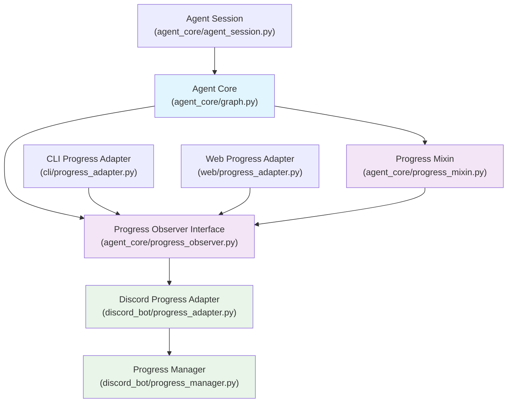

# llmcord 專案重構提案 (簡化版)

---

## 1. 目標 (Goals)

本次重構旨在建立一個統一、模組化且可擴展的智慧代理（Agent）架構，核心目標是實現一個靈活且配置驅動的工作流程：

*   **統一工作流程**: 透過一個統一的 LangGraph 流程處理所有請求。代理將根據配置和輪次限制，動態評估並決定使用適當的工具，實現「訊息 -> (代理評估使用工具 -> 回傳 -> 多輪交互) -> 最終答案」的自動化流程。
*   **可組合的代理**: 代理的能力由一套可插拔、可設定的工具和輪次限制定義，使其功能可透過設定檔動態調整。
*   **提升模組化與簡潔性**: 重新組織專案結構，使模組職責更清晰、耦合度降低，提升可維護性與擴展性。
*   **以參考架構為基礎**: 以 `reference_arch.md` 中定義的核心流程和概念為指導，確保 `agent_core` 的設計和實作與之保持一致。

---

## 2. 現有 LangGraph Agent 功能流程分析

本節重點說明為實現統一代理架構，訊息處理流程將如何簡化與變革：

#### 主要變革點：統一代理處理流程
*   **Agent 配置檢查**: 根據配置確認可用工具及最大工具使用輪次。
*   **統一 Agent 執行**: 取代原有模式選擇，Agent 將自動決策是否使用工具，支援多輪工具調用、進度回報，並受輪次控制。
*   **LangGraph 統一執行**: 流程將基於新的 LangGraph 設計，包含 LLM 推理、工具調用、結果整合、反思與路由、以及最終答案生成。

#### 關鍵功能注意事項
*   **Random System Prompt (Persona)**: 透過 `prompt_system/prompts.py` 統一管理，依配置決定是否啟用隨機系統提示詞。
*   **Discord 特定系統提示**: 統一在 `prompt_system/prompts.py` 中處理時間戳、Bot ID 及用戶名等 Discord 相關提示。
*   **LangGraph 會話狀態管理**: 由 `agent_core/agent_session.py` 負責會話 ID 生成、狀態持久化與自動清理，支援多輪對話上下文。

---

## 3. 新專案架構設計（統一 Agent 行為）

```
llmcord/
│
├── main.py                  # 程式主入口，初始化 Bot 並啟動 Agent 核心
├── config.yaml              # 系統設定檔，包含工具配置、輪次限制等
├── personas/                # 存放不同性格的 Agent 系統提示詞
│
├── discord_bot/
│   ├── client.py            # Discord Client 初始化
│   ├── message_handler.py   # 處理 Discord 事件，將訊息轉換為通用訊息格式後傳遞給統一 Agent
│   ├── message_collector.py # 訊息收集與預處理
│   ├── progress_manager.py  # Discord 進度消息管理
│   ├── response_formatter.py# LLM 回覆後處理與發送
│   └── progress_adapter.py  # Discord 進度適配器 (實作 ProgressObserver)
│
├── agent_core/              # **[核心]** 統一的 Agent 處理引擎
│   ├── agent.py             # **[新/簡化]** 統一 Agent 實作，提供獨立運作介面 (極度精簡，僅作為入口)
│   ├── graph.py             # **[核心新]** 負責 LangGraph 構建、所有節點定義及直接內嵌工具邏輯 (如 Google Search)
│   ├── agent_session.py     # 管理單次對話的 Agent 會話與狀態
│   ├── agent_utils.py       # **[新]** 存放 Agent 核心專屬的輔助函式
│   ├── progress_observer.py # **[新]** 進度觀察者介面，定義 ProgressEvent 和 ProgressObserver
│   └── progress_mixin.py    # **[新]** 進度更新混入，提供 _notify_progress 等方法
│
├── prompt_system/           # **[簡化]** 統一的提示詞管理系統
│   ├── prompts.py           # **[新/合併]** 統一管理所有 Agent 提示詞、Persona 選擇與系統提示詞組裝
│
├── schemas/                 # 結構化資料模式
│   ├── agent_types.py       # **[新/合併]** 統一的代理相關型別定義 (包含 OverallState, SearchQueryList, Reflection 等)
│   └── discord.py           # Discord 相關結構
│
├── tools/
│   └── citation.py          # 引用管理工具
│
├── utils/
│   ├── config_loader.py     # 設定檔讀取與管理
│   ├── logger.py            # 日誌系統設定
│   └── discord_utils.py     # Discord 互動輔助函式
│
└── tests/
    └── ...                  # 所有測試檔案
```

#### 進度管理解耦架構示意


---

## 4. 模組職責與新流程設計

### 4.1 核心模組職責

#### `agent_core/` - 統一 Agent 處理引擎
*   **`agent.py`**: 作為統一入口點，負責初始化並執行 `agent_core/graph.py` 中的 LangGraph 實例，管理 Agent 執行生命週期。**此模組設計為與特定的應用（如 Discord）完全解耦，只處理通用的訊息和狀態。**
*   **`graph.py`**: **核心職責**是根據配置動態構建 LangGraph 的 `StateGraph`。它將定義所有 LangGraph 節點的實現，包括 `generate_query_or_plan` (生成查詢/規劃)、`tool_selection` (工具選擇)、`execute_tool` (執行工具)，以及 `reflection` (反思)、`evaluate_research` (評估研究) 和 `finalize_answer` (最終答案)。**這些節點的設計和流程將嚴格參考 `reference_arch.md` 中定義的 Agent 核心流程。**所有工具的具體實現（如 Google Search 的調用、grounding metadata 處理、引用生成）將直接內嵌於相應的節點內部 (例如 `execute_tool` 節點內)，不再作為獨立的 `tools/` 模組。
*   **`agent_session.py`**: 管理單次對話的 Agent 會話與狀態。
*   **`agent_utils.py`**: 存放 Agent 核心邏輯強相關的輔助函式，如引用處理、研究主題獲取。
*   **`progress_observer.py`**: 定義通用進度事件 (`ProgressEvent`) 和觀察者介面 (`ProgressObserver`)，實現 Agent 核心與外部 UI (如 Discord) 的解耦。包含 `on_progress_update`, `on_completion`, `on_error` 抽象方法。
*   **`progress_mixin.py`**: 提供 `ProgressMixin` 類別，包含 `add_progress_observer`, `_notify_progress`, `_notify_completion`, `_notify_error` 等方法，讓 `UnifiedAgent` 可以通知註冊的觀察者。

#### `prompt_system/prompts.py` - 統一提示詞管理
*   負責合併所有提示詞管理功能，包括 Random persona 選擇、系統提示詞組裝（包含 Discord 特定、時間、用戶名等資訊）、動態工具說明生成。

#### `schemas/agent_types.py` - 統一的代理相關型別定義
*   合併與 Agent 核心流程相關的所有類型定義，包含 `OverallState` (簡化後的統一狀態結構)、`SearchQueryList`、`Reflection` 及通用訊息結構 `MsgNode`。

#### `tools/` - 工具系統
*   `base.py` (LangGraph 工具基底類別) 將被**移除**，因為工具邏輯將直接內嵌於 `agent_core/graph.py` 中的節點。
*   `citation.py` 引用管理工具維持。

### Web Search 實作說明 (更新)
*   **Google Search 邏輯直接內嵌於 `agent_core/graph.py` 的 `execute_tool` 節點中**：這包括 `google.genai.Client` 的調用、搜尋查詢執行、grounding metadata 處理、引用和來源生成。這將消除獨立的 `tools/google_search.py` 模組。
*   **支援兩種使用場景**：
    1.  **0 輪模式**：不使用任何工具，純對話。
    2.  **N 輪模式**：使用 `execute_tool` 節點進行工具調用與研究，該節點內部直接處理所有工具相關邏輯。

### 4.2 新的統一流程設計

```
Discord Message
      ↓
discord_bot/message_handler.py (轉換為通用 MsgNode & 載入配置)
      ↓
agent_core/agent.py (初始化並執行 LangGraph)
      ↓
agent_core/graph.py (LangGraph 統一執行流程)
      ↓
generate_query_or_plan (生成查詢/規劃)
      ↓
tool_selection (工具選擇)
      ↓
execute_tool (執行工具，例如 web_search 節點直接處理 Google Search)
      ↓
reflection (反思)
      ↓
evaluate_research (評估研究)
      ├─ 達到輪次限制 / 結果充分 → finalize_answer (生成最終回覆) → END
      └─ 需要更多資訊 → 返回 generate_query_or_plan 或 tool_selection (下一輪)
      ↓
finalize_answer (生成最終回覆)
      ↓
prompt_system/prompts.py (統一的提示詞組裝，包含 Persona & Discord 特定處理)
      ↓
Final Answer
      ↓
discord_bot/response_formatter.py (格式化 & 發送回覆)
```

---

## 4.3 配置驅動的 Agent 行為

#### Tool Priority 說明
*   **priority 數值**：決定工具在 LangGraph 中的調用順序
*   **較小數值 = 較高優先級**：priority: 1 會在 priority: 2 之前執行
*   **用途**：當 Agent 決定使用多個工具時，按優先級順序執行
*   **範例**：google_search (priority: 1) → citation (priority: 2)

```yaml
# 統一 Agent 配置
agent:
  # 工具配置 - 決定 Agent 能力
  tools:
    google_search:
      enabled: true
      priority: 1
    citation:
      enabled: true
      priority: 2
  
  # 行為控制 - 決定 Agent 使用深度
  behavior:
    max_tool_rounds: 2        # 0=純對話, 1=簡單查詢, 2+=深度研究
    timeout_per_round: 30     # 每輪最大時間
    enable_reflection: true   # 啟用結果反思
    enable_progress: true     # 啟用進度回報
    
  # 決策參數
  thresholds:
    tool_usage: 0.3          # 何時開始使用工具
    completion: 0.8          # 何時認為結果足夠
    confidence: 0.7          # 工具結果信心度閾值

# 提示詞系統配置  
prompt_system:
  persona:
    enabled: true
    random_selection: true
    cache_personas: true
  discord_integration:
    include_timestamp: true
    include_mentions: true
    timezone: "Asia/Taipei"
```

### 4.4 現有 `agents/` 目錄模組處理細則

為了實現新架構的統一性與模組化，現有 `agents/` 目錄下的模組將按以下原則進行處理：

*   **`agents/tools_and_schemas.py`**
    *   **重構方案**：工具定義將被**移除**並整合至 `agent_core/graph.py` 的 `execute_tool` 節點內部。代理相關的資料結構將遷移至 `schemas/agent_types.py`。
    *   **目標**：確保所有工具定義和資料結構都符合新的模組化原則，並清除冗餘或過時的代碼。

*   **`agents/configuration.py`**
    *   **重構方案**：此檔案的內容將會被整合至新的 `config.yaml` 中，作為 Agent 行為和決策的統一配置來源。
    *   **目標**：實現 Agent 行為的完全配置驅動，消除代碼中硬編碼的配置邏輯。

*   **`agents/utils.py`**
    *   **重構方案**：此檔案中的 Agent 核心相關輔助函式將遷移至新的 `agent_core/agent_utils.py`。其餘通用輔助函數將遷移至其他通用 `utils` 檔案，若無用則移除。
    *   **目標**：確保輔助函數的職責清晰，避免單一大型工具檔案，提升代碼可讀性與維護性。

---

## 5. 實作任務拆分與階段目標

### Phase 1: 基礎架構與狀態管理 (2-3 weeks)

#### Week 1: 基礎架構建立
**目標**: 建立新目錄結構和基礎模組

**任務清單**:
- [ ] **Task 1.1**: 建立新目錄結構與基礎模組框架
  - 建立 `agent_core/`, `prompt_system/`, `schemas/`, `discord_bot/` 目錄
  - 設置基本的 `__init__.py` 檔案
  - 建立基本的模組框架

- [ ] **Task 1.2**: 遷移基礎模組
  - 遷移 `utils/config_loader.py` (原 `core/config.py`)
  - 遷移 `utils/logger.py` (原 `core/logger.py`)
  - 遷移 `utils/common_utils.py` (原 `core/utils.py` 部分功能)
  - 更新 import 路徑

- [ ] **Task 1.3**: 建立 schemas 模組
  - 遷移 `schemas/agent_types.py` (合併原 `agents/state.py` 及 `discordbot/msg_node.py` 中的相關結構)
  - 統一狀態結構，移除模式相關狀態

**測試驗證**:
```bash
# 基礎模組測試
python -c "from utils.config_loader import load_config; print('✓ Config loader works')"
python -c "from schemas.agent_types import OverallState; print('✓ Agent schemas work')"
```

### Phase 2: Agent 進度更新解耦任務 (1 week)

**目標**: 實現 Agent 核心與外部進度更新機制的解耦，採用 Observer Pattern + Mixin 架構。

**任務清單**:
- [ ] **Task 2.1**: 建立進度觀察者介面
  - 建立 `agent_core/progress_observer.py`，定義通用進度事件和觀察者介面
  - **參考實現**:
    ```python
    # agent_core/progress_observer.py
    from abc import ABC, abstractmethod
    from dataclasses import dataclass, field
    from typing import Dict, Any, Optional, List

    @dataclass
    class ProgressEvent:
        """通用進度事件"""
        stage: str
        message: str
        progress_percentage: Optional[int] = None
        eta_seconds: Optional[int] = None
        metadata: Dict[str, Any] = field(default_factory=dict)

    class ProgressObserver(ABC):
        """進度觀察者介面"""
        
        @abstractmethod
        async def on_progress_update(self, event: ProgressEvent) -> None:
            """處理進度更新"""
            pass
        
        @abstractmethod
        async def on_completion(self, final_result: str, sources: Optional[List[Dict]] = None) -> None:
            """處理完成事件"""
            pass
        
        @abstractmethod
        async def on_error(self, error: Exception) -> None:
            """處理錯誤事件"""
            pass
    ```

- [ ] **Task 2.2**: 實作進度更新混入
  - 建立 `agent_core/progress_mixin.py`，提供進度通知功能
  - **參考實現**:
    ```python
    # agent_core/progress_mixin.py
    from typing import List, Optional
    from .progress_observer import ProgressObserver, ProgressEvent

    class ProgressMixin:
        """進度更新 Mixin"""
        
        def __init__(self):
            self._progress_observers: List[ProgressObserver] = []
        
        def add_progress_observer(self, observer: ProgressObserver):
            """添加進度觀察者"""
            self._progress_observers.append(observer)
        
        async def _notify_progress(self, stage: str, message: str, 
                                  progress_percentage: Optional[int] = None,
                                  eta_seconds: Optional[int] = None,
                                  **metadata):
            """通知所有觀察者進度更新"""
            event = ProgressEvent(
                stage=stage, message=message,
                progress_percentage=progress_percentage,
                eta_seconds=eta_seconds, metadata=metadata
            )
            
            for observer in self._progress_observers:
                try:
                    await observer.on_progress_update(event)
                except Exception as e:
                    self.logger.error(f"進度觀察者更新失敗: {e}")
        
        async def _notify_completion(self, final_result: str, sources: Optional[List[Dict]] = None):
            """通知完成"""
            for observer in self._progress_observers:
                try:
                    await observer.on_completion(final_result, sources)
                except Exception as e:
                    self.logger.error(f"完成通知失敗: {e}")
    ```

- [ ] **Task 2.3**: 修改 UnifiedAgent 支援進度更新
  - 修改 `agent_core/graph.py` 中的 `UnifiedAgent` 類別繼承 `ProgressMixin`
  - 在關鍵節點中添加進度通知調用：
    - `generate_query_or_plan`: 通知分析開始
    - `execute_tool`: 通知工具執行進度，包含輪次和百分比
    - `reflection`: 通知反思階段
    - `finalize_answer`: 通知答案生成和完成
  - 添加錯誤處理，確保進度通知失敗不影響 Agent 主流程
  - **參考修改**:
    ```python
    # agent_core/graph.py (部分修改)
    from .progress_mixin import ProgressMixin

    class UnifiedAgent(ProgressMixin):
        def __init__(self, config: Optional[Dict[str, Any]] = None):
            super().__init__()  # 初始化 ProgressMixin
            # ... 原有初始化代碼
        
        def generate_query_or_plan(self, state: OverallState) -> Dict[str, Any]:
            try:
                # 通知開始階段
                asyncio.create_task(self._notify_progress(
                    stage="generate_query", 
                    message="🤔 正在分析您的問題..."
                ))
                # ... 原有邏輯
            except Exception as e:
                asyncio.create_task(self._notify_error(e))
                raise
        
        def execute_tool(self, state: OverallState) -> Dict[str, Any]:
            try:
                current_round = state.tool_round + 1
                max_rounds = self.behavior_config.get("max_tool_rounds", 1)
                
                asyncio.create_task(self._notify_progress(
                    stage="execute_tool",
                    message=f"🔍 正在使用 {state.selected_tool} 搜尋資料...",
                    progress_percentage=int((current_round / max_rounds) * 50)
                ))
                # ... 原有邏輯
            except Exception as e:
                asyncio.create_task(self._notify_error(e))
                raise
    ```

- [ ] **Task 2.4**: 建立 Discord 進度適配器
  - 建立 `discord_bot/progress_adapter.py`，實現 Discord 特定的進度觀察者
  - **參考實現**:
    ```python
    # discord_bot/progress_adapter.py
    import discord
    from agent_core.progress_observer import ProgressObserver, ProgressEvent
    from .progress_manager import get_progress_manager
    from schemas.agent_types import DiscordProgressUpdate, ResearchSource

    class DiscordProgressAdapter(ProgressObserver):
        """Discord 進度適配器"""
        
        def __init__(self, original_message: discord.Message):
            self.original_message = original_message
            self.progress_manager = get_progress_manager()
        
        async def on_progress_update(self, event: ProgressEvent) -> None:
            """處理進度更新"""
            discord_progress = DiscordProgressUpdate(
                stage=event.stage,
                message=event.message,
                progress_percentage=event.progress_percentage,
                eta_seconds=event.eta_seconds
            )
            
            await self.progress_manager.send_or_update_progress(
                original_message=self.original_message,
                progress=discord_progress
            )
        
        async def on_completion(self, final_result: str, sources: Optional[List[Dict]] = None) -> None:
            """處理完成事件"""
            completion_progress = DiscordProgressUpdate(
                stage="completed",
                message="✅ 研究完成！",
                progress_percentage=100
            )
            
            research_sources = []
            if sources:
                research_sources = [
                    ResearchSource(title=s.get("title", ""), url=s.get("url", ""), snippet=s.get("snippet", ""))
                    for s in sources
                ]
            
            await self.progress_manager.send_or_update_progress(
                original_message=self.original_message,
                progress=completion_progress,
                final_answer=final_result,
                sources=research_sources
            )
    ```

- [ ] **Task 2.5**: 整合 Discord 訊息處理
  - 修改 `discord_bot/message_handler.py`，在 Agent 處理中註冊進度適配器
  - **參考修改**:
    ```python
    # discord_bot/message_handler.py (簡化版)
    from agent_core.graph import create_unified_agent
    from .progress_adapter import DiscordProgressAdapter

    async def process_message_with_agent(new_msg: discord.Message, cfg: Dict[str, Any]):
        """使用統一 Agent 處理訊息"""
        try:
            # 創建 Agent 實例
            agent = create_unified_agent(cfg)
            
            # 創建並註冊 Discord 進度適配器
            progress_adapter = DiscordProgressAdapter(new_msg)
            agent.add_progress_observer(progress_adapter)
            
            # 準備初始狀態並執行
            initial_state = OverallState(messages=[MsgNode(role="user", content=new_msg.content)])
            graph = agent.build_graph()
            result = await graph.ainvoke(initial_state)
            
        except Exception as e:
            logging.error(f"Agent 處理失敗: {e}")
            await new_msg.reply("抱歉，處理您的請求時發生錯誤。")
    ```

- [ ] **Task 2.6**: 重構配置架構為型別安全的 Dataclass 結構
  - 重新組織 `config.yaml` 為分層結構，提升可讀性和維護性
  - 建立 `schemas/config_types.py` 使用 Pydantic 或 dataclass 定義配置結構
  - 建立 `utils/config_loader.py` 支援型別安全的配置載入和驗證
  - **參考結構**:
    ```python
    # schemas/config_types.py
    from dataclasses import dataclass, field
    from typing import Dict, Any, List, Optional
    from pathlib import Path
    import yaml

    @dataclass
    class ToolConfig:
        """工具配置"""
        enabled: bool = False
        priority: int = 999
        config: Dict[str, Any] = field(default_factory=dict)

    @dataclass
    class AgentBehaviorConfig:
        """Agent 行為配置"""
        max_tool_rounds: int = 1
        timeout_per_round: int = 30
        enable_reflection: bool = True
        enable_progress: bool = True

    @dataclass
    class AgentThresholdsConfig:
        """Agent 決策閾值配置"""
        tool_usage: float = 0.3
        completion: float = 0.8
        confidence: float = 0.7

    @dataclass
    class AgentConfig:
        """Agent 核心配置"""
        tools: Dict[str, ToolConfig] = field(default_factory=dict)
        behavior: AgentBehaviorConfig = field(default_factory=AgentBehaviorConfig)
        thresholds: AgentThresholdsConfig = field(default_factory=AgentThresholdsConfig)

    @dataclass
    class DiscordPermissionsConfig:
        """Discord 權限配置"""
        allow_dms: bool = False
        users: Dict[str, List[int]] = field(default_factory=lambda: {"allowed_ids": [], "blocked_ids": []})
        roles: Dict[str, List[int]] = field(default_factory=lambda: {"allowed_ids": [], "blocked_ids": []})
        channels: Dict[str, List[int]] = field(default_factory=lambda: {"allowed_ids": [], "blocked_ids": []})

    @dataclass
    class DiscordConfig:
        """Discord Bot 配置"""
        bot_token: str = ""
        client_id: str = ""
        status_message: str = "AI Assistant"
        limits: Dict[str, int] = field(default_factory=lambda: {"max_text": 100000, "max_images": 3, "max_messages": 25})
        permissions: DiscordPermissionsConfig = field(default_factory=DiscordPermissionsConfig)
        maintenance: Dict[str, Any] = field(default_factory=lambda: {"enabled": False, "message": "維護中..."})

    @dataclass
    class LLMModelConfig:
        """LLM 模型配置"""
        model: str = "gemini-2.0-flash-exp"
        temperature: float = 0.7

    @dataclass
    class LLMConfig:
        """LLM 配置"""
        default_model: str = "openai/gemini-2.0-flash-exp"
        providers: Dict[str, Dict[str, str]] = field(default_factory=dict)
        models: Dict[str, LLMModelConfig] = field(default_factory=dict)

    @dataclass
    class PromptSystemConfig:
        """提示詞系統配置"""
        persona: Dict[str, Any] = field(default_factory=lambda: {
            "enabled": True, "random_selection": True, "cache_personas": True, "default_file": "default.txt"
        })
        discord_integration: Dict[str, bool] = field(default_factory=lambda: {
            "include_timestamp": True, "include_mentions": True, "include_user_context": True
        })
        system_prompt: Dict[str, Any] = field(default_factory=lambda: {
            "use_file": True, "file": "trump.txt", "fallback": "你是一個有用的 AI 助手。"
        })

    @dataclass
    class SystemConfig:
        """系統配置"""
        timezone: str = "Asia/Taipei"
        debug_mode: bool = False
        log_level: str = "INFO"

    @dataclass
    class AppConfig:
        """應用程式總配置"""
        system: SystemConfig = field(default_factory=SystemConfig)
        discord: DiscordConfig = field(default_factory=DiscordConfig)
        llm: LLMConfig = field(default_factory=LLMConfig)
        agent: AgentConfig = field(default_factory=AgentConfig)
        prompt_system: PromptSystemConfig = field(default_factory=PromptSystemConfig)
        
        @classmethod
        def from_yaml(cls, config_path: str) -> 'AppConfig':
            """從 YAML 文件載入配置"""
            with open(config_path, 'r', encoding='utf-8') as f:
                data = yaml.safe_load(f)
            
            # 遞歸轉換字典為 dataclass
            return cls._dict_to_dataclass(data, cls)
        
        @staticmethod
        def _dict_to_dataclass(data: Dict[str, Any], dataclass_type):
            """將字典轉換為 dataclass"""
            # 實現字典到 dataclass 的轉換邏輯
            # 這裡可以使用 dacite 或 pydantic 等庫來簡化
            pass
        
        def get_tool_config(self, tool_name: str) -> Optional[ToolConfig]:
            """獲取特定工具的配置"""
            return self.agent.tools.get(tool_name)
        
        def is_tool_enabled(self, tool_name: str) -> bool:
            """檢查工具是否啟用"""
            tool_config = self.get_tool_config(tool_name)
            return tool_config.enabled if tool_config else False
    ```
    
    ```python
    # utils/config_loader.py (更新版)
    from schemas.config_types import AppConfig
    from pathlib import Path
    import logging

    _config_cache: Optional[AppConfig] = None

    def load_config(config_path: str = "config.yaml", force_reload: bool = False) -> AppConfig:
        """載入配置，支援快取"""
        global _config_cache
        
        if _config_cache is None or force_reload:
            try:
                _config_cache = AppConfig.from_yaml(config_path)
                logging.info(f"配置載入成功: {config_path}")
            except Exception as e:
                logging.error(f"配置載入失敗: {e}")
                raise
        
        return _config_cache

    def get_agent_config() -> AgentConfig:
        """快速獲取 Agent 配置"""
        return load_config().agent

    def get_discord_config() -> DiscordConfig:
        """快速獲取 Discord 配置"""
        return load_config().discord
    ```

**測試驗證**:
```bash
# 進度更新功能測試
python -c "from agent_core.progress_observer import ProgressEvent; print('✓ Progress observer works')"
python -c "from agent_core.progress_mixin import ProgressMixin; print('✓ Progress mixin works')"
python -c "from discord_bot.progress_adapter import DiscordProgressAdapter; print('✓ Discord adapter works')"
```

### Phase 3: Discord Bot 整合與舊模組清理 (2-3 weeks)

**目標**: 將 Discord Bot 模組與新的統一 Agent 架構整合，並清理舊的模組。

**任務清單**:
- [ ] **Task 3.1**: Discord Bot 核心邏輯調整
  - 簡化 `discord_bot/message_handler.py`，使其主要負責接收 Discord 訊息，進行基本的訊息過濾（例如機器人自身訊息、用戶訊息過濾），將核心訊息內容轉換為 `schemas/agent_types.py` 定義的通用訊息格式 (`MsgNode`)，並呼叫 `agent_core/agent.py` 中的統一 Agent 介面。
  - 調整 `discord_bot/client.py` 確保其能正確載入新的 Agent 實例。
  - **具體清理任務（來自先前的分析）：**
    *   從 `message_handler.py` 移除權限檢查 (`is_bad_user`, `is_bad_channel`)、維護模式檢查等邏輯。
    *   移除 `reload_config()` 的直接呼叫。
    *   移除 `initialize_langgraph_systems()` 的呼叫。
    *   移除 `OpenAI` 客戶端初始化和模型能力判斷邏輯。
    *   移除對 `pipeline.rag` 和 `pipeline.llm` 的直接呼叫。
    *   移除舊的 `msg_nodes` 全局變數的管理和清理邏輯。

- [ ] **Task 3.2**: 整合提示詞系統
  - 更新 `discord_bot/message_handler.py` 以使用 `prompt_system/prompts.py` 統一管理提示詞，包括 Discord 特定提示詞的組裝。

- [ ] **Task 3.3**: 整合響應格式化與發送
  - 確保 `discord_bot/response_formatter.py` 正確處理來自 Agent 核心的最終答案，並以 Discord 友好的格式發送。

- [ ] **Task 3.4**: 舊模組清理與遷移
  - **移除 `discordbot(old)/` 目錄**: 清理所有不再需要的舊 Discord Bot 相關檔案，包括 `discordbot(old)/message_handler.py`, `discordbot(old)/client.py`, `discordbot(old)/msg_node.py`。
  - **移除 `core/session_manager.py`**: 由於 `agent_core/agent_session.py` 將管理所有會話，移除舊的會話管理模組並更新所有相關引用。
  - **重構 `pipeline/` 模組**: 
    - 從 `pipeline/rag` 和 `pipeline/llm` 中移除所有與 LangGraph 代理核心流程或工具調用（特別是 Google Search）相關的邏輯
    - 確保這些功能已完全遷移至 `agent_core/graph.py` 的相應節點
    - 如果模組完全失去其職責，則考慮移除
  - **清理 `agents/` 目錄**: 
    - 移除 `agents/tools_and_schemas.py`，工具定義已內嵌至 `agent_core/graph.py`，資料結構已遷移至 `schemas/agent_types.py`
    - 移除 `agents/configuration.py`，內容已整合至 `config.yaml`
    - 移除 `agents/utils.py`，Agent 核心相關函式已遷移至 `agent_core/agent_utils.py`
    - 移除 `agents/research_agent.py` 中的 `create_progress_callback` 和相關 Discord 耦合邏輯
  - **清理舊訊息節點管理**: 
    - 移除 `discordbot(old)/msg_node.py` 文件
    - 從所有相關文件中移除對 `msg_nodes` 全局變數的引用和操作
    - 確保 `MsgNode` 的定義已成功遷移到 `schemas/agent_types.py`
  - **清理舊進度管理**: 
    - 遷移或移除 `agents.tools_and_schemas.DiscordTools.cleanup_old_messages` 的功能
    - 如果該功能在新架構中仍有必要，則應將其遷移至 `discord_bot/progress_manager.py`
  - **清理舊提示詞功能**: 
    - 從 `core/utils.py` 中移除 `random_system_prompt` 相關功能
    - 更新所有對其的引用，使其指向 `prompt_system/prompts.py` 中新的實現

**測試驗證**:
```bash
# 整合測試 (需要啟動 Bot 並實際發送訊息，驗證端到端流程)
# 確保 Discord Bot 能夠正確響應，Agent 邏輯正常運作，且無舊模組遺留問題。
```

### Phase 4: 進階功能與優化 (Ongoing)

**目標**: 持續優化 Agent 性能、擴展功能並提升使用者體驗。

**任務清單**:
- [ ] **Task 4.1**: 錯誤處理與日誌改進
- [ ] **Task 4.2**: 效能優化 (例如： LangGraph Cache, 工具並行化)
- [ ] **Task 4.3**: 擴展工具庫
- [ ] **Task 4.4**: 更多應用場景支援 (如 CLI, Web UI 整合)
  - 實現 CLI 進度適配器 (`cli/progress_adapter.py`)，將進度事件輸出到終端
  - 實現 Web 進度適配器 (`web/progress_adapter.py`)，透過 WebSocket 或 SSE 發送進度更新
  - **參考實現**:
    ```python
    # cli/progress_adapter.py
    from agent_core.progress_observer import ProgressObserver, ProgressEvent
    
    class CLIProgressAdapter(ProgressObserver):
        async def on_progress_update(self, event: ProgressEvent) -> None:
            if event.progress_percentage:
                print(f"[{event.progress_percentage}%] {event.message}")
            else:
                print(f"[進行中] {event.message}")
        
        async def on_completion(self, final_result: str, sources=None) -> None:
            print(f"[完成] {final_result}")
    
    # web/progress_adapter.py  
    class WebProgressAdapter(ProgressObserver):
        def __init__(self, websocket_connection):
            self.websocket = websocket_connection
        
        async def on_progress_update(self, event: ProgressEvent) -> None:
            await self.websocket.send_json({
                "type": "progress",
                "stage": event.stage,
                "message": event.message,
                "percentage": event.progress_percentage
            })
    ```

**測試驗證**:
```bash
# 根據具體優化內容進行測試
```

---

## 6. 配置設計與行為定義

### 6.1 統一配置結構

**目標**: 建立清晰、分層的配置架構，方便管理和修改。

```yaml
# ===== 核心系統配置 =====
system:
  timezone: "Asia/Taipei"
  debug_mode: false
  log_level: "INFO"

# ===== Discord Bot 配置 =====
discord:
  bot_token: "YOUR_BOT_TOKEN"
  client_id: "YOUR_CLIENT_ID"
  status_message: "我愛小祥 汪汪"
  
  # 訊息處理限制
  limits:
    max_text: 100000
    max_images: 3
    max_messages: 25
  
  # 權限控制
  permissions:
    allow_dms: false
    users:
      allowed_ids: []
      blocked_ids: []
    roles:
      allowed_ids: []
      blocked_ids: []
    channels:
      allowed_ids: []
      blocked_ids: []
  
  # 維護模式
  maintenance:
    enabled: false
    message: "抱歉，我正在維護中..."

# ===== LLM 提供商配置 =====
llm:
  # 預設模型
  default_model: "openai/gemini-2.0-flash-exp"
  
  # 提供商設定
  providers:
    openai:
      base_url: "https://generativelanguage.googleapis.com/v1beta/openai"
      api_key: "YOUR_GEMINI_API_KEY"
    gemini:
      api_key: "YOUR_GEMINI_API_KEY"
    # ... 其他提供商
  
  # 不同用途的模型配置
  models:
    tool_analysis:
      model: "gemini-2.0-flash-exp"
      temperature: 0.1
    final_answer:
      model: "gemini-2.0-flash-exp"
      temperature: 0.7
    reflection:
      model: "gemini-2.0-flash-exp"
      temperature: 0.3

# ===== Agent 核心配置 =====
agent:
  # 工具配置 - 決定 Agent 能力
  tools:
    google_search:
      enabled: true
      priority: 1
      config:
        max_results: 5
        timeout: 10
    citation:
      enabled: true
      priority: 2
  
  # 行為控制 - 決定 Agent 使用深度
  behavior:
    max_tool_rounds: 2        # 0=純對話, 1=簡單查詢, 2+=深度研究
    timeout_per_round: 30     # 每輪最大時間
    enable_reflection: true   # 啟用結果反思
    enable_progress: true     # 啟用進度回報
    
  # 決策參數
  thresholds:
    tool_usage: 0.3          # 何時開始使用工具
    completion: 0.8          # 何時認為結果足夠
    confidence: 0.7          # 工具結果信心度閾值

# ===== 提示詞系統配置 =====
prompt_system:
  # Persona 設定
  persona:
    enabled: true
    random_selection: true
    cache_personas: true
    default_file: "default.txt"
  
  # Discord 整合
  discord_integration:
    include_timestamp: true
    include_mentions: true
    include_user_context: true
  
  # 系統提示詞
  system_prompt:
    use_file: true
    file: "trump.txt"
    fallback: "你是一個有用的 AI 助手。"

# ===== 進度更新配置 =====
progress:
  # Discord 進度更新
  discord:
    enabled: true
    use_embeds: true
    update_interval: 2  # 秒
    cleanup_delay: 30   # 完成後清理延遲
  
  # CLI 進度更新
  cli:
    enabled: true
    show_percentage: true
    show_eta: true

# ===== 開發與測試配置 =====
development:
  session_file: "sessions.json"
  enable_mock_tools: false
  test_mode: false
```

**配置分層說明**:
- **system**: 全域系統設定
- **discord**: Discord Bot 特定配置
- **llm**: LLM 提供商和模型配置
- **agent**: Agent 核心行為配置
- **prompt_system**: 提示詞管理配置
- **progress**: 進度更新機制配置
- **development**: 開發和測試相關配置

### 6.2 Agent 行為範例

#### 場景 1: 純對話 Agent (max_tool_rounds: 0)
```yaml
agent:
  tools: {}  # 不啟用任何工具
  behavior:
    max_tool_rounds: 0
```
→ 行為：純 LLM 對話，快速回應，適合閒聊

#### 場景 2: 簡單查詢 Agent (max_tool_rounds: 1)
```yaml
agent:
  tools:
    google_search: {enabled: true}
  behavior:
    max_tool_rounds: 1
```
→ 行為：最多進行一次搜索，適合簡單問題查詢

#### 場景 3: 深度研究 Agent (max_tool_rounds: 3)
```yaml
agent:
  tools:
    google_search: {enabled: true}
    citation: {enabled: true}
  behavior:
    max_tool_rounds: 3
    enable_reflection: true
```
→ 行為：多輪工具使用，深度分析，適合複雜研究

---

## 7. 成功標準與驗收條件

### 7.1 功能性標準
- [ ] 統一 Agent 支援 0-N 輪工具使用
- [ ] 配置驅動的 Agent 行為調整
- [ ] 保留所有現有功能
- [ ] Persona 系統正常運作

### 7.2 簡潔性標準  
- [ ] 移除模式相關的代碼與配置
- [ ] Agent 實作統一在單一模組中
- [ ] 提示詞系統統一管理
- [ ] 配置結構更直觀易懂

### 7.3 可擴展性標準
- [ ] 新增工具只需實作工具類別並更新配置
- [ ] 調整 Agent 行為只需修改配置檔案
- [ ] 支援動態工具組合與輪次調整
- [ ] 模組職責清晰，易於維護

---

## 8. 總結

本重構提案採用**統一 Agent 設計**，透過**工具配置與輪次限制**來定義 Agent 能力，並將**工具邏輯直接內嵌於 LangGraph 節點中**，徹底簡化了系統架構：

### 8.1 主要改進
1.  **移除模式區分**: 不再有研究模式 vs 傳統模式，全部統一為可配置的 Agent 行為。
2.  **配置驅動**: Agent 的能力完全由配置檔案決定，從純對話到深度研究都在同一套系統中。
3.  **輪次控制**: 通過 `max_tool_rounds` 參數控制 Agent 的工具使用深度。
4.  **工具組合**: 可任意組合工具，每個工具可獨立啟用/停用。
5.  **架構簡化**: 移除了 router、多個 agent 類別等複雜結構，工具邏輯直接內嵌，減少模組間依賴。

### 8.2 使用靈活性
*   **0 輪**: 純對話 Agent，快速回應。
*   **1 輪**: 簡單查詢 Agent，進行一次工具調用。
*   **N 輪**: 深度研究 Agent，多次工具調用與反思。

這種設計讓系統更簡潔、更直觀，同時保持了原有的所有功能，並提供了更大的擴展靈活性。